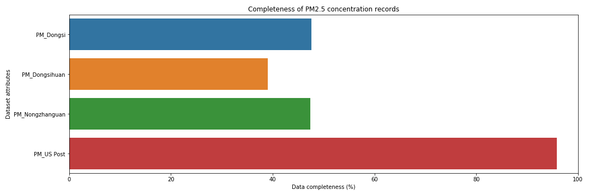

PM2.5 Density Prediction based on a Two-Stage Rolling Forecast Model using
LightGBM
=====================================

This repo is created for storing relevant programs used in my air quality
prediction project.

## Dataset description

Found in [UCI Machine Learning Repository][1], the dataset is a collection of
PM2.5 concentration statistics in five Chinese cities between the beginning of
2010 and the end of 2015, and we only use the dataset of Beijing
([`BeijingPM20100101_20151231.csv`][2]).

### Attributes in the original dataset

After some data preprocessing, we classify the dataset attributes (columns)
into two types:

1. Label columns: All these columns combined denote the time when the values
   are recorded.

- **year**: Year of the record
- **season**: 1=Spring, 2=Summer, 3=Fall, 4=Winter
- **month**: Month of the record
- **day**: Day of the record
- **hour**: Hour at which the row is recorded

2. Value columns: PM2.5 concentration and other meteorological parameters

- **PM_Dongsi,PM_Dongsihuan,PM_Nongzhanguan,PM_US Post**: PM2.5 Concentration
  measured in different stations (ug/m<sup>3</sup>)
- **DEWP**: Celsius Dew Point
- **TEMP**: Celsius temperature
- **HUMI**: Humidity (%)
- **PRES**: Air Pressure (hPa, i.e. 1 hPa=100 Pa)
- **precipitation**: Precipitation (millimeters)
- **Iprec**: Cumulated precipation (millimeters)
- **cbwd**: Combined wind direction (`cv` refers to still wind, `NE` and others refer to geographic direction)
- **Iws**: Cumulated wind speed (m/s)

### Academic information

Dataset's Digital Object Identifier (DOI): `doi:10.1002/2016JD024877`

Citation:

> Liang, X., S. Li, S. Zhang, H. Huang, and S. X. Chen (2016), PM2.5 data
> reliability, consistency, and air quality assessment in five Chinese cities,
> J. Geophys. Res. Atmos., 121, 10220-10236.

## Data Preprocessing

_Technical details about this section can be found in
[`pm25_preprocessing.ipynb`][3]_

### Outliers removal

We discovered that this dataset contains both outliers and missing values, so
we follow certain schemes to remove anomalous values and refill them with
missing value imputation techniques. First, we identify any values that do not
fall within a specific _normal range_ as outliers. Then, we set these values to
NAN and handle them with imputation techniques.

### Missing values imputation

The original dataset contains many missing values, and more of them emerge
after removing anomalies. As a result, we adopt a variety of methods to impute
them: we use Next Observation Carried Backward (NOCB) to impute missing values
appearing at the beginning of the records; we use Last Observation Carried
Forward (LOCF) to handle missing values at the end of the records; and at last,
we use linear interpolation to handle missing values that emerge in rest of the
places.

Since the dataset contains PM2.5 measured by multiple stations, we decide to
impute and use the PM2.5 data measured in the U.S. Diplomatic Post because it
contains the most complete PM2.5 data in compared to those in other stations.



### Handling non-numerical attributes

In our dataset, not every attribute can be expressed in terms of real numbers.
For instance, `cbwd` (Combined wind direction) is a categorical attribute and
cannot be imputed using numerical methods. Hence, we only use NOCB and LOCF
methods to handle missing values of these non-numerical attributes.

Following the imputation, we assign different numbers to different values of
categorical features. In particular, we use the following instruction to handle
`cbwd` attributes (in which `data` refers to the dataframe object of the
dataset).

```python
data["cbwd"]=data["cbwd"].map({"cv":0,"NW":1,"NE":2,"SE":3})
```

After data preprocessing, we begin analyzing the dataset itself.

## Feature engineering

_Technical details about this section can be found in
[`pm25_features.ipynb`][3]_

This section will be available in my report that will be published.

[1]: https://archive.ics.uci.edu/ml/datasets/PM2.5+Data+of+Five+Chinese+Cities
[2]: BeijingPM20100101_20151231.csv
[3]: pm25_features.ipynb
